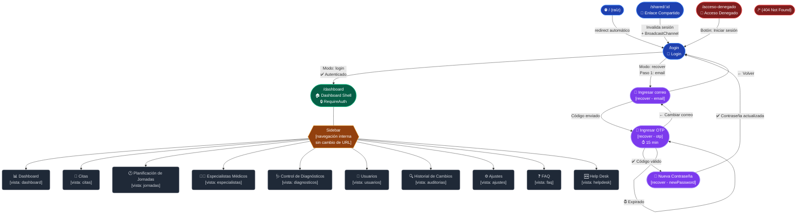

# 🗺️ Mapa de Navegación — MediCitas (Health Flow Dashboard)

> **Auditoría Frontend** · Sistema: `health-flow-dashboard` · Router: React Router DOM v6 · Arquitectura: SPA con estado interno de página en `/dashboard`

---

## 1. Resumen de la Arquitectura de Rutas

El sistema usa **dos capas de navegación distintas**:

| Capa | Mecanismo | Descripción |
|---|---|---|
| **Router-level** | `<Routes>` en `App.tsx` | URLs reales del browser. 5 rutas declaradas. |
| **In-app (dashboard)** | `useState` en `Index.tsx` | Navegación por sidebar sin cambio de URL. 10 vistas internas. |

> [!IMPORTANT]
> Las vistas del dashboard (`/citas`, `/especialistas`, etc.) **no tienen URL propia**. Todas viven bajo `/dashboard`. Esto es relevante para el SEO, el historial del navegador y los deep-links.

---

## 2. Rutas del Router (URL reales)

| Ruta | Componente | Protegida | Descripción |
|---|---|---|---|
| `/` | `<Navigate to="/login">` | ❌ Pública | Redirige automáticamente a `/login` |
| `/login` | `Login.tsx` | ❌ Pública | Autenticación + Recuperación de contraseña |
| `/dashboard` | `Index.tsx` (vía `RequireAuth`) | ✅ **Privada** | Shell del dashboard. Requiere `token` en `localStorage` |
| `/shared/:id` | `SharedOpen.tsx` | ❌ Pública | Abre un enlace compartido, invalida sesión activa y redirige a `/login` |
| `/acceso-denegado` | `AccesoDenegado.tsx` | ❌ Pública | Pantalla de error de permisos clínicos |
| `*` (cualquier otra) | `NotFound.tsx` | ❌ Pública | Página 404 |

---

## 3. Flujo de Autenticación (`/login`)

La página de Login implementa un **máquina de estados interna** con dos modos y tres pasos de recuperación:

```
[/login]
├── Modo: LOGIN
│   ├── Formulario: Correo + Contraseña
│   ├── [Éxito] → Redirige a /dashboard
│   └── [¿Olvidaste tu contraseña?] → Cambia a modo RECOVER
│
└── Modo: RECOVER (Recuperación de contraseña)
    ├── Paso 1: email      → Ingresar correo electrónico
    │   └── [Enviar código] → Solicita OTP al backend
    ├── Paso 2: otp        → Ingresar código OTP (6 dígitos, temporizador 15 min)
    │   ├── [Verificar]    → Valida el código
    │   └── [Expirado]     → Botón "Reenviar código"
    └── Paso 3: newPassword → Ingresar y confirmar nueva contraseña
        └── [Confirmar]    → Actualiza contraseña, regresa a modo LOGIN
```

---

## 4. Guardia de Ruta — `RequireAuth`

- **Mecanismo**: Verifica la existencia de `token` en `localStorage`.
- **Sin token** → Redirige a `/login` preservando la ruta de origen (`state.from`).
- **Con token** → Renderiza el componente hijo (`<Index />`).

---

## 5. Ruta especial — `/shared/:id`

- Es una ruta **pública** que actúa como **interceptor de sesión**.
- Al abrirse, emite un `BroadcastChannel` `'shared-session'` para notificar a otras pestañas.
- Las otras pestañas que reciban el evento limpian el token y redirigen a `/login`.
- La propia página `/shared/:id` también limpia la sesión y redirige a `/login` tras 400ms.
- **Propósito**: Abrir un enlace compartido desde un email/notificación sin dejar la sesión anterior activa.

---

## 6. Vistas Internas del Dashboard (`/dashboard`)

La navegación es controlada por `useState('dashboard')` en `Index.tsx` y el `Sidebar.tsx`.

| ID de estado | Etiqueta en Sidebar | Ícono | Componente |
|---|---|---|---|
| `dashboard` | Dashboard | `Activity` | `DashboardContent` |
| `citas` | Citas | `CalendarDays` | `CitasPage` |
| `jornadas` | Planificación de Jornadas | `Clock` | `JornadasPage` |
| `especialistas` | Especialistas Médicos | `UserCog` | `EspecialistasPage` |
| `diagnosticos` | Control de Diagnósticos | `Stethoscope` | `DiagnosticosPage` |
| `usuarios` | Usuarios | `Users` | `UsuariosPage` |
| `auditorias` | Historial de Cambios | `FileSearch` | `AuditoriasPage` |
| `ajustes` | Ajustes | `Settings` | `AjustesPage` |
| `faq` | FAQ | `HelpCircle` | `FAQPage` |
| `helpdesk` | Help Desk | `LifeBuoy` | `HelpDeskPage` |

> [!NOTE]
> El Sidebar soporta **modo colapsado** (solo iconos) con toggle. La vista activa por defecto al autenticarse es `dashboard`.

---

## 7. Diagrama Mermaid — Árbol de Navegación



---

